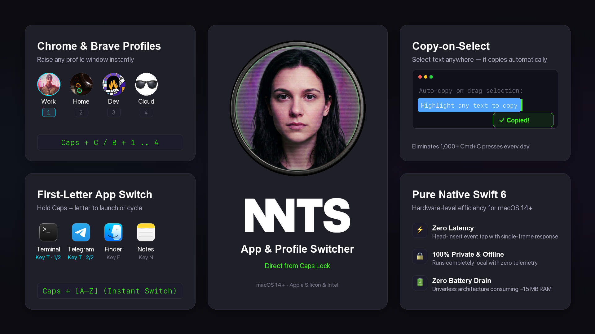

# NNTS

[](https://github.com/unacau/nnts/releases/latest)
[](https://github.com/unacau/nnts)
[](LICENSE)

Instantly jump to specific Chrome or Brave profiles with <kbd>caps lock</kbd> + <kbd>C</kbd>/<kbd>B</kbd> + <kbd>1..4</kbd>, switch to favorite apps by their first letter while holding <kbd>caps lock</kbd>, and eliminate repetitive <kbd>Cmd</kbd>+<kbd>C</kbd> keystrokes with automatic copy-on-select.

```bash
brew install unacau/tap/nnts
```
*Or download **[NNTS.dmg](https://github.com/unacau/nnts/releases/latest/download/NNTS.dmg)**.*

---

## Shortcuts

<p align="center">
  
</p>

| Shortcut | Action | Target / Details |
| :--- | :--- | :--- |
| <kbd>caps lock</kbd> + <kbd>C</kbd> / <kbd>B</kbd> + <kbd>1..4</kbd><br> | **Direct Profile Jump** | Instantly raise a specific Chrome (`C`) or Brave (`B`) profile window |
| <kbd>caps lock</kbd> + <kbd>C</kbd> / <kbd>B</kbd> | **Profile Cycle** | Cycle through browser profiles with a minimalist HUD overlay |
| <kbd>caps lock</kbd> + <kbd>[a–z]</kbd> | **First-Letter App Switch** | Instant switch to any app by its first letter (<kbd>T</kbd> Terminal, <kbd>F</kbd> Finder, <kbd>N</kbd> Notes, <kbd>S</kbd> Spotify, etc.) |
| *Repeated tap on key* | **App Cycle** | Cycle through all applications sharing the same first letter |
| **Select Text (drag)** | **Copy-on-Select** | Auto-copies selected text to clipboard with instant cursor toast (no <kbd>Cmd</kbd>+<kbd>C</kbd>) |

*Holding <kbd>caps lock</kbd> displays the minimalist HUD overlay. Press <kbd>Esc</kbd> anytime to dismiss.*

---

## Under the Hood

* **Driverless Remap:** Physical caps lock is remapped to `F18` via `/usr/bin/hidutil`. No green LED, no accidental uppercase.
* **Sub-16ms Latency:** Head-insert `CGEventTap` intercepts hotkeys before the window server for single-frame switching.
* **Reliable Profile Switching:** Uses native macOS Accessibility (`kAXMenuBarAttribute`) on the browser's "Profiles" menu, not fragile window title regexes.
* **100% Local & Lightweight:** Zero telemetry/network calls, ~15 MB RAM, 0% idle CPU. Resets keyboard layout on exit.

---

## Build & Diagnostics

```bash
# Build & install from source
make native install

# Run test suite
make test

# Stream local diagnostics (os_log)
make monitor
```

## Uninstall

```bash
brew uninstall nnts   # or remove /Applications/NNTS.app
```

---

## License

MIT © [Igor Ekishev](https://github.com/unacau)
